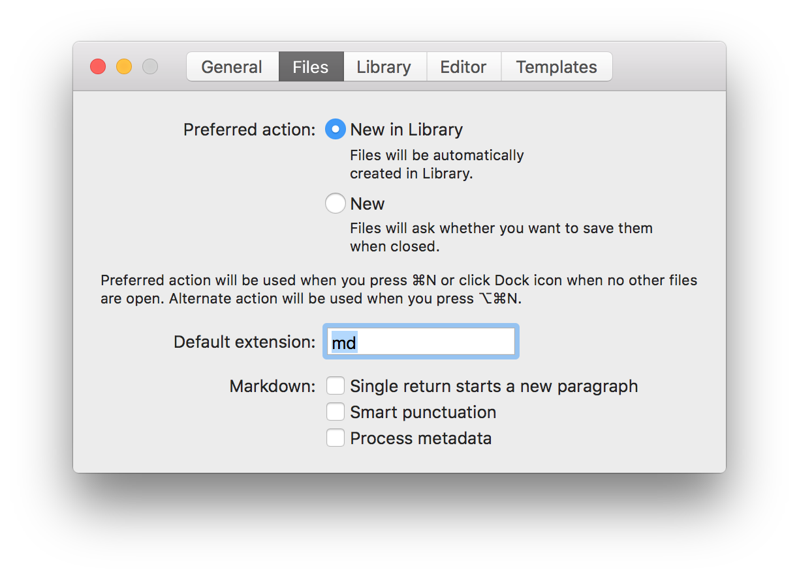
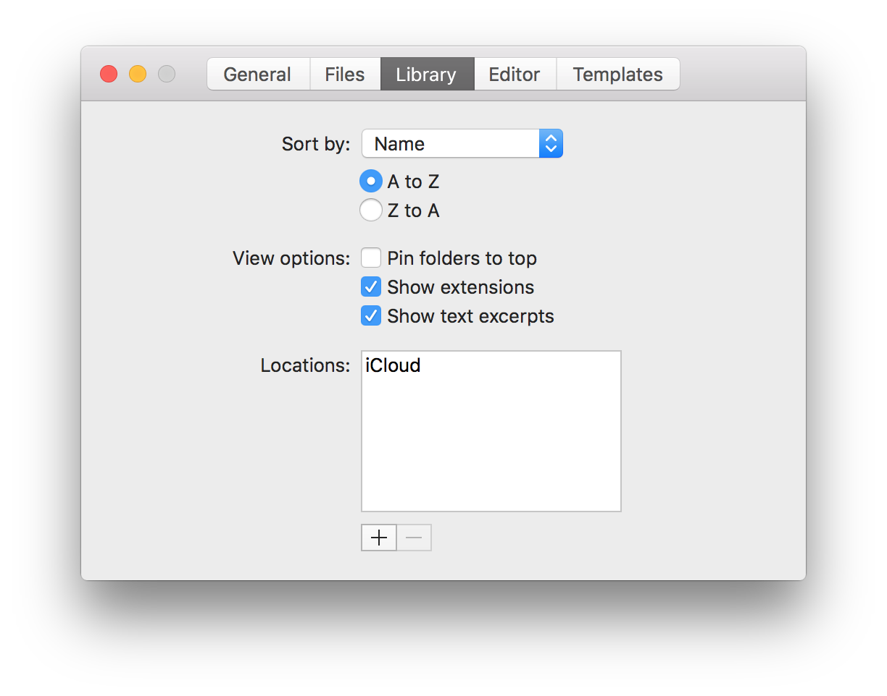

My Writing Setup

I had a mild nerdy breakthrough in the middle of the night. It was one of those "can't sleep, why is this kinda stuff keeping me up at night moments." I decided to embrace it. I got up out of bed and headed to the living room to figure it out. Usually, and hour of this will wear me out and let me go back to sleep. That's just how I work.

I've been trying, for some time, to come up with a writing workflow that will work for me. I'm a little persnickety about these kinds of things, so just downloading and app like [iA Writer](https://ia.net/writer/) and calling it a day isn't gonna do it for me.

Basically I need the following.

1. A clean, distraction free writing tool.
2. The tool should work seamlessly across all my devices.
3. I shouldn't have to worry about saving or losing my data.
4. I should be able to easily, simply, organize my work. (files and folders)
5. It should have revision control that I can understand.
6. I should be able to easily collaborate with others if I want to.
7. It should be pretty simple to push my finished work to WordPress.

The first 4 describe iA Writer pretty well. I'm actually using it to write this post from my iPhone right now. I've been using iA writer for a good long while now, but I've never thought of it as my go-to writing tool. It's always just been this nice thing I try out every once in a while. The main issue has always been, it didn't do 5-7.

So, they fixed 7. You can now link up your WordPress or Medium account and let iA writer create a draft in those platforms when you're ready. 

For 5 and 6, here's what I did, late last night, so your miles may vary.

1. Set iA Writer's default extension to .md


2. Set iA Writer to sync your data with iCloud


3. Create a symbolic link called "Writer" pointing to a special folder where iA Writer stores islets data
```
$ ln -s /Users/<username>/Library/Mobile\ Documents/27N4MQEA55~pro~writer/Documents Writer
```

4. Use GutHub

That last one is pretty vague, but basically, once you have a symlink to your data, it's pretty easy to set up any kind of git repositories you'd like within. Here's what I'm doing.

1. Every post has a folder in a parent folder called "blogs."
2. Each folder has at minimum two files. One called README.md and the other called whatever the post is called.
3. Use the README to describe the post, and later to link to where it lives on your blog.
4. Push this all to a GitHub repo. This can be set to private while you work on the post and later switched to public if you want to.
5. You can add repo collaborators if you want people to edit your work, but be careful as they will have full write access to the repo. (Can be more granular about that if it's an organization account.)

I'm digging this setup. It pretty easily adds real, Git based, revision control to my workflow. Obviously people I collaborate would need to be a little GitHub savvy, but that's ok with me for this sort of thing!

Now that this is all in place. If you see a typo, you can [submit a pull-request]() to me. Yay!


